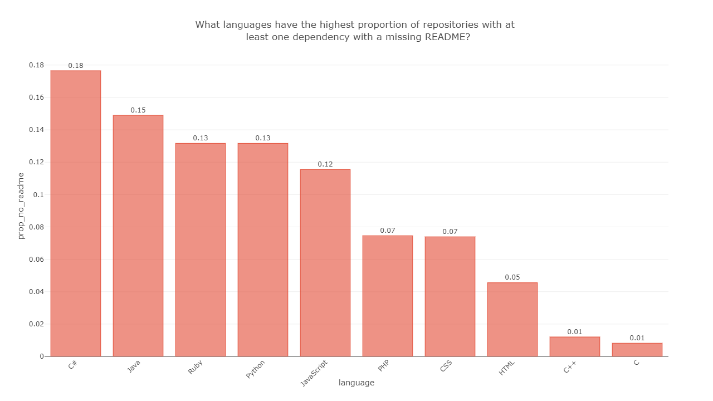

Murtaza Jafferji
December 12th, 2018

# Exploring Risk in Top 10 Software Ecosystems

## Introduction

According to Forrester and Gartner, between 80-90% of all software developers use open source components within their applications.<sup>[\[1\]](https://snyk.io/stateofossecurity/)</sup> Incorporating open source components into applications may dramatically speed up development time and reduce costs, but there are large risks involved with having open source dependencies, due to the security, licensing, and the future maintenance of these dependencies. In addition, each new package pulls in a network of additional dependencies of its own, called transitive dependencies.

As a developer, it’s almost impossible to know everything about each of these dependencies. An illustrative example of the risk posed by the inclusion of open source dependencies is an event that took place this year. On September 9, 2018, a popular package called *event-stream*, took *flatmap-stream* as a dependency. On October 5, 2018, an updated was published to the package, *flatmap-stream*, which had some malicious code hiding at the end of its minified build. Due to their dependence on *event-stream*, thousands of applications suddenly took a transitive dependency on the malicious package, *flatmap-stream*. One of these applications, was *copay-dash*, a popular bitcoin platform. 

In this highly targetted attack, the malicious code stole users’ private keys for cryptocurrency wallets and sent those keys along with account details to a remote server controlled by hackers. The malicious code was added in September and was not noticed for two months, only because the attacker mistakenly included the deprecated crypto.createDecipher rather than crypto.createDecipheriv, which raised a suspicious deprecation warning in another library that consumed event-stream.<sup>[\[2\]](https://schneid.io/blog/event-stream-vulnerability-explained/)</sup>

Due to the trend in open source communities of including a growing number of packages as dependencies over time, the risks posed by these inclusions is increasing. Thus, it is imperative that developers have a more cautious approach to including open source dependencies. In this analyis, we hope to make developers aware of the the level of risk across various factors within the top 10 most used software ecosystems and identify the most used packages which exhibit risk.

For this analysis, we will consider the following factors as indications of risk: 
* *Number of dependencies* (including transitive dependencies), which indicates the number of points of failure
* *Total open issues for all dependencies*, which can be correlated to number of bugs or vulnerabilities 
* *Unmaintaned or deprecated status*, which indicates the project will not be fixed if vulnerabilities or bugs are found
* *Only one contributor*, which potentially indicates that on maintainer can publish code unchecked 
* *Not updated in the past 12 months*, which potentially indicates an unmaintained project
* *Missing README*, which is indicative of poor documentation and quality
* *Missing LICENSE*, which can produce a legal risk

**Human-centered design inspiration**

The decision to pursue this project was inspired by the desire to bring attention to the risks involved in software development that affect the lives of all technology users worldwide. Data breaches that involve personal information are becoming increasingly common, and if developers do not take more care in auditing the dependency trees of their applications, the risk for breaches involving personal data will continue to grow.

## Related Work

A study published in October, 2017 titled, An Empirical Comparison of Dependency Network Evolution in Seven Software Packaging Ecosystems<sup>[\[3\]](https://arxiv.org/pdf/1710.04936.pdf)</sup>, assesses the quality of different package dependency networks, but does not explore the network of millions of end user applications that depend on these packages.
    
In an attempt to try and provide a global view of open source software's security health, Synk, a network security company that helps developers stay secure, created the 2017 State of Open Source Security Report<sup>[\[1\]](https://snyk.io/stateofossecurity/pdf/The%20State%20of%20Open%20Source.pdf)</sup>. Here are a few key findings of the report:
> * The number of open source packages indexed has exploded in the past year: Rubygems 10%, Python 32%, Maven 28%, npm 57%. 6.3 billion Python packages have been downloaded using PyPi and over 87.3 billion Node packages using npm.
> * 79.5% of open-source maintainers say that they have no public-facing disclosure policy in place, and those that do are more than three times as likely to have a vulnerability disclosed to them privately.
> * Of 433,000 sites tested, 77% run at least one client-side JavaScript library with a known security vulnerability.
> * There’s no guarantee of the security knowledge of an open source maintainer. Only 16.8% of maintainers consider their security  know-how to be high, and 43.7%  have never conducted a security audit on their code.
> * The National Vulnerability Database (NVD) has seen a large increase in vulnerabilities, but coverage can be an issue, with npm having 11% coverage.

A notable limitation of Synk's approach is that it looks at the adoption rates of open source software in terms of number of downloads and the number of packages published, but these numbers are not a good indicators of adoption<sup>[\[4\]](https://blog.tidelift.com/dont-believe-the-download-numbers-when-evaluating-open-source-projects)</sup>.

## Research Questions

We will instead use the number of dependencies across various ecosystems as our indicator of adoption and answer the following questions:

### Finding the top 10 software ecosystems
1. What languages have the highest number of repositories?
2. Are the number of average number of dependencies per repository increasing over time?

### Ranking ecosystems by individual risk factors
1. What languages have the highest average number of dependencies per repository?
2. What languages have the highest average number of total open issues for all dependencies per repository?
3. What languages have the highest proportion of repositories with at least one dependency with an unmaintained/deprecated status?
4. What languages have the highest proportion of repositories with at least one dependency with only one contributor?
5. What languages have the highest proportion of repositories with at least one dependency that has not been updated in the past 12 months?
6. What languages have the highest proportion of repositories with at least one dependency with a missing or non-compliant license?
7. What languages have the highest proportion of repositories with at least one dependency with a missing README?

### Identifying most used projects that exhibit risk
1. What are the most used projects that have an unmaintained/deprecated status per language?
2. What are the most used projects that have only one contributor per language?
3. What are the most used projects that have not been updated in the past 12 months per language?
4. What are the most used projects that have a missing or non-compliant licenses per language?
5. What are the most used projects that have a missing README per language?

## Dataset
### Datset used in this analysis
>[Libraries.io Open Source Repository and Dependency Metadata](https://libraries.io/data)
>
>Libraries.io gathers data from 36 package managers and 3 source code repositories. We track over 2.7m unique open source packages, 33m repositories and 235m interdependencies between them. This gives Libraries.io a unique understanding of open source software. An understanding that we want to share with you. 
>
>In this release you will find data about software distributed and/or crafted publicly on the Internet. You will find information about its development, its distribution and its relationship with other software included as a dependency. You will not find any information about the individuals who create and maintain these projects.
>
>This public dataset is hosted in Google BigQuery and is included in BigQuery's 1TB/mo of free tier processing. This means that each user receives 1TB of free BigQuery processing every month, which can be used to run queries on this public dataset. Watch this short video to learn how to get started quickly using BigQuery to access public datasets.
>
>[Source](https://console.cloud.google.com/marketplace/details/libraries-io/librariesio)

### What is BigQuery?
>BigQuery is Google's fully managed, NoOps, low cost analytics database. With BigQuery you can query terabytes of data without needing a database administrator or any infrastructure to manage. BigQuery uses familiar SQL and a pay-only-for-what-you-use charging model. BigQuery allows you to focus on analyzing data to find meaningful insights.
>
>[Source](https://codelabs.developers.google.com/codelabs/bigquery-github/index.html?index=..%2F..%2Findex#0)


### License
>This dataset is released under the [Creative Commons Attribution-ShareAlike 4.0 International Licence](https://creativecommons.org/licenses/by-sa/4.0/).
>
>This licence provides the user with the freedom to use, adapt and redistribute this data. In return the user must publish any derivative work under a similarly open licence, attributing Libraries.io as a data source. The full text of the licence is included in the data.
>
> [Source](https://zenodo.org/record/1196312#.W_v3OHdFzZs)


## Analysis

### Setup
1. Install required packages via a terminal window
```bash
pip install -e git+https://github.com/SohierDane/BigQuery_Helper#egg=bq_helper
pip install plotly
pip install cufflinks
npm install -g electron@1.8.4 orca
pip install psutil
```
2. Restart the notebook Kernel (Kernel -> Restart)

We will perform the following analysis with Google BigQuery. Since this dataset receives continuous updates, in order to enable reproducibility of this report, results of all queries have been saved as csv files in the /data directory. If REPRODUCIBILITY_MODE is set to True, data will be read from these csv files and the Google BigQuery setup steps can be ignored. If REPRODUCIBILITY_MODE is set to False, queries will be run against the live BigQuery tables.


```python
REPRODUCIBILITY_MODE = True
```

### BigQuery client setup
Note: The following steps only need to be performed if REPRODUCIBILITY_MODE is set to False
> 1. In the GCP Console, go to the Create service account key page.
> [Go to the Create Service Account Key page](https://console.cloud.google.com/apis/credentials/serviceaccountkey?_ga=2.216172310.-16877527.1543232590&project=api-8220795080820646267-783724&folder&organizationId)
> 2. From the Service account drop-down list, select New service account.
> 3. In the Service account name field, enter a name .
> 4. From the Role drop-down list, select Project > Owner. 
> 5. Click Create. A JSON file that contains your key downloads to your computer.
> 6. Provide authentication credentials to your application code by setting the environment variable GOOGLE_APPLICATION_CREDENTIALS using the command below. Replace [PATH] with the file path of the JSON file that contains your service account key. This variable only applies to your current shell session, so if you open a new session, set the variable again. 
>
> [Source](https://cloud.google.com/bigquery/docs/reference/libraries#client-libraries-install-python)


```python
if not REPRODUCIBILITY_MODE: 
    # Example: %env GOOGLE_APPLICATION_CREDENTIALS=C:/Users/murtjaf/Downloads/Google Play Android Developer-c5edbdb9185f.json
    %env GOOGLE_APPLICATION_CREDENTIALS=[PATH] # set [PATH] with the file path of the JSON file that contains your service account key
```

    env: GOOGLE_APPLICATION_CREDENTIALS=C:/Users/murtjaf/Downloads/Google Play Android Developer-c5edbdb9185f.json
    

Use the [bq_helper](https://www.kaggle.com/sohier/introduction-to-the-bq-helper-package) package to create a bq_assistant, which will allow us to run read-only BigQuery SQL queries from within this Python environment.


```python
if not REPRODUCIBILITY_MODE:
    import bq_helper
    from bq_helper import BigQueryHelper
    bq_assistant = bq_helper.BigQueryHelper(active_project="bigquery-public-data",
                                       dataset_name="libraries_io")
```

Run the following code to create the /images and /data directories to save the outputs of the the BigQuery queries and matplotlib/plotly graphs.


```python
import os
if not os.path.exists('images'):
    os.makedirs('images')
if not os.path.exists('data'):
    os.makedirs('data')
```

Run the following code to define the helper functions that will be used to generate charts


```python
import plotly.offline as offline
import plotly.io as pio
import plotly.plotly as py
import pandas as pd
import cufflinks as cf
import plotly.graph_objs as go
from ast import literal_eval
import matplotlib.pyplot as plt
import re
import numpy as np

offline.init_notebook_mode(connected=True)
   
    
def run_query(query, question):
    """If REPRODUCIBILITY_MODE is True, load the data for the question from the csv file. 
       If REPRODUCIBILITY_MODE is False, run the query in Google BigQuery and save the results to a csv file
    
    Arguments:

        query -- SQL Query that will be run in Google BigQuery
        question -- Question for which the query will be run
    """
        
    filename = 'data/{0}.csv'.format(get_filename(question))
    if REPRODUCIBILITY_MODE:
        if not os.path.isfile(filename):
            raise Exception('File does not exist. Cannot run in REPRODUCIBILITY_MODE')
        response = pd.read_csv(filename) 
        if (len(response) > 0):
            for column in response:
                value = response[column][0]
                if isinstance(value, str):
                    if value.startswith('[') and value.endswith(']'):
                        response[column] = response[column].apply(literal_eval)
    else:
        print("{0:.2f} GB".format(bq_assistant.estimate_query_size(query)))
        response = bq_assistant.query_to_pandas(query)
        response.to_csv(filename, index=False)

    print("Data: {0}".format(filename))
    return response

def generate_chart(data, pivot_column, pivot_value_column, question, kind='bar', index=None, sum_values=True, grouped_by_column=None, list_column=None):
    """Generate Plotly chart and save to image file
    
    Arguments:

        data -- DataFrame that will be plotted
        pivot_column -- Column to use to make new frame’s columns
        pivot_value_column -- Column to use for populating new frame’s values
        question -- Question for which the chart is being generated
        kind -- Kind of chart (scatter, bar)
        index -- Column to use to make new frame’s index
        sum_values -- If True, sum the pivoted DataFrame
        grouped_by_column -- Column that data was grouped by
        list_column -- Column that contains values in a list 
    """
        
    def generate_figure(data):
        pivoted = data.pivot(index=index, columns=pivot_column, values=pivot_value_column)
        sorted_pivoted = pivoted.sum().sort_values(ascending=False) if sum_values else pivoted
        return sorted_pivoted.iplot(asFigure=True, kind=kind)
    figure = None
    if list_column is not None:
        plotly_data = []
        def merge_column(row):
            for column, value in row.iteritems():
                if column != list_column:
                    for obj in row[list_column]:
                        obj[column] = row[column]
        data.apply(lambda x: merge_column(x), axis=1)
        for i, row in data.iterrows():
            v =  pd.DataFrame(row[list_column])
            fig = generate_figure(v)
            bar = fig.data[0]
            bar.name = row[grouped_by_column]
            bar.marker.color = None
            plotly_data.append(bar)
        figure = go.Figure(data=plotly_data)
    else:
        figure = generate_figure(data)
        
    json = figure.to_plotly_json()

    if kind == 'bar':
        v = np.vectorize(format_value)
        for bar in json['data']:
            bar['text'] = v(bar['y'])
            bar['textposition'] = 'outside'
            bar['x'] = v(bar['x'])
    
    json['layout'] = {'title': question, 'xaxis': {'title': pivot_column, 'automargin': True, 'tickangle': -45},'yaxis': {'title': pivot_value_column, 'automargin': True}}
    offline.iplot(json)

    filename = 'images/{0}.png'.format(get_filename(question))
    
    json['layout']['width'] = 1280 
    json['layout']['height'] = 720 
    pio.write_image(json, filename)
    print("Chart image: {0}".format(filename))

# Reference: https://stackoverflow.com/questions/295135/turn-a-string-into-a-valid-filename
def get_filename(s):
    """Generate a filename given a string by stripping invalid characters, removing stopwords, and replacing spaces with _
    
    Arguments:

        s -- Input string
    """
        
    s = str(s).strip().lower()
    s = re.sub(r'(?u)[^-\s\w.]', '', s)
    stopwords = ['what','have', 'the', 'of', 'in', 'are', 'has', 'with', 'that', 'a', 'an', 'br']
    querywords = s.split()
    resultwords  = [word for word in querywords if word.lower() not in stopwords]
    result = '_'.join(resultwords)
    return result

def format_value(x):
    """Format floats to two decimal places, add thousands separator for numbers, and returns value after last : or / for strings
    
    Arguments:

        x -- Input value that is formatted differently depending on type
    """
        
    if isinstance(x, float):
        return '{:,.2f}'.format(x).replace('.00','')
    elif isinstance(x, int):
        return '{:,}'.format(x)
    elif isinstance(x, str):
        return re.split('[:/]', x)[-1]
    else:
        return x
```

## Finding the top 10 software ecosystems

### What languages have the highest number of repositories?
We first want to find the top 10 software ecosystems by finding the languages that have the largest number of repositories.


```python
query = """
SELECT
    language,
    COUNT(*) AS repositories_count
FROM
    `bigquery-public-data.libraries_io.repositories`
WHERE 
    language <> ''
GROUP BY
    language
ORDER BY
    repositories_count DESC
LIMIT
    10;
        """

question = 'What languages have the highest number of repositories?'
response = run_query(query, question)
generate_chart(response, 'language', 'repositories_count', question)
```

    Data: data/languages_highest_number_repositories.csv
    


    Chart image: images/languages_highest_number_repositories.png
    

Run the following command to set the langugages string that will be used in the queries through the rest of the analysis using the results of the query above. In order to perform the analysis against another set of languages, set the languages string to 
REPRODUCIBILITY_MODE to False.


```python
languages = "'{0}'".format("', '".join(pd.read_csv('data/languages_highest_number_repositories.csv')['language']))
# Set manually by uncommenting the lines below
# languages = "'R', 'Python', 'Go'"
# REPRODUCIBILITY_MODE = False
print(languages)
```

    'JavaScript', 'Java', 'Python', 'HTML', 'PHP', 'Ruby', 'CSS', 'C++', 'C#', 'C'
    

### Are the number of average number of dependencies per repository increasing over time?
We want to verify our claim that there is a trend in open source communities to include a growing number of packages as dependencies over time. Note: We determine the date of the project by the last_pushed_timestamp.


```python
query = """
SELECT 
    language,
    AVG(count) AS average_dependency_count,
    FORMAT_TIMESTAMP('%Y', last_pushed_timestamp) as last_updated_year
FROM
    (SELECT
      repositories.language AS language,
      repositories.id,
      repositories.last_pushed_timestamp AS last_pushed_timestamp,
      COUNT(*) AS count
    FROM
      `bigquery-public-data.libraries_io.repositories` AS repositories
    JOIN
      `bigquery-public-data.libraries_io.repository_dependencies` AS repository_dependencies
    ON 
        repositories.id = repository_dependencies.repository_id
    WHERE 
        repositories.language IN ({0})
    AND
        repositories.last_pushed_timestamp IS NOT NULL
    GROUP BY
        repositories.language,
        repositories.id,
        repositories.last_pushed_timestamp) AS T1
GROUP BY
    language,
    last_updated_year
ORDER BY
    last_updated_year ASC;
""".format(languages)

question = 'Are the number of average number of dependencies per repository increasing over time?'
response = run_query(query, question)
generate_chart(response, 'language', 'average_dependency_count', question, kind='scatter', index='last_updated_year', sum_values=False)
```

    Data: data/number_average_number_dependencies_per_repository_increasing_over_time.csv
    


    Chart image: images/number_average_number_dependencies_per_repository_increasing_over_time.png
    

### What languages have the highest average number of dependencies per repository?
We group the repository_dependencies by repository id and language and then get the average number of rows after grouping by language. The repository_dependencies contains the transitive dependencies. Note: This approach ignores repositories that do not have any dependencies.


```python
query = """
SELECT
  language,
  AVG(count) AS average_dependency_count
FROM
    (SELECT
      repositories.language AS language,
      repositories.id,
      COUNT(*) AS count
    FROM
      `bigquery-public-data.libraries_io.repositories` AS repositories
    JOIN
      `bigquery-public-data.libraries_io.repository_dependencies` AS repository_dependencies
    ON 
        repositories.id = repository_dependencies.repository_id
    WHERE 
        language IN ({0})
    GROUP BY
        repositories.language,
        repositories.id) AS T1
GROUP BY
    language
ORDER BY
  average_dependency_count DESC
LIMIT
  10;
""".format(languages)

question = 'What languages have the highest average number of dependencies per repository?'
response = run_query(query, question)
generate_chart(response, 'language', 'average_dependency_count', question)
```

    Data: data/languages_highest_average_number_dependencies_per_repository.csv
    


    Chart image: images/languages_highest_average_number_dependencies_per_repository.png
    

### What languages have the highest average number of total open issues for all dependencies per repository?

We group the repository_dependencies by repository id and language and then get the average number of open issues after grouping by language.


```python
query = """
SELECT 
    language,
    AVG(open_issues) AS tot_issues_repo
FROM
    (SELECT 
        repositories.language AS language,
        repositories.id AS id,
        SUM(projects_with_repository_fields.repository_open_issues_count) AS open_issues
    FROM
        `bigquery-public-data.libraries_io.repository_dependencies` AS repository_dependencies
    JOIN
        `bigquery-public-data.libraries_io.projects_with_repository_fields` AS projects_with_repository_fields
    ON 
        repository_dependencies.dependency_project_id = projects_with_repository_fields.id
    JOIN
        `bigquery-public-data.libraries_io.repositories` AS repositories
    ON 
        repositories.id = repository_dependencies.repository_id
    WHERE 
        repositories.language IN ({0})
    GROUP BY
        repositories.language,
        repositories.id) AS T1
GROUP BY
    language
ORDER BY
    tot_issues_repo DESC;
""".format(languages)

question = 'What languages have the highest average number of total open issues for all dependencies per repository?'
response = run_query(query, question)
generate_chart(response, 'language', 'tot_issues_repo', question)
```

    Data: data/languages_highest_average_number_total_open_issues_for_all_dependencies_per_repository.csv


    Chart image: images/languages_highest_average_number_total_open_issues_for_all_dependencies_per_repository.png
    

### What languages have the highest proportion of repositories with at least one dependency with an unmaintained/deprecated status?
We find the number of repositories per language that have at least one dependency that has an unmaintained or deprecated status and divide by the total number of repositories per language.


```python
query = """
SELECT 
    T1.language,
    T1.count / T2.count AS prop_deprecated  
FROM
    (SELECT 
        language,
        COUNT(*) AS count
    FROM
        (SELECT 
            repositories.language AS language,
            repositories.id AS id
        FROM
            `bigquery-public-data.libraries_io.repository_dependencies` AS repository_dependencies
        JOIN
            `bigquery-public-data.libraries_io.projects` AS projects
        ON 
            repository_dependencies.dependency_project_id = projects.id
        JOIN
            `bigquery-public-data.libraries_io.repositories` AS repositories
        ON 
            repositories.id = repository_dependencies.repository_id
        WHERE 
            repositories.language IN ({0})
        AND
            projects.status IN ('Deprecated', 'Unmaintained')
        GROUP BY
            repositories.language,
            repositories.id) AS T1
    GROUP BY
        language) AS T1
JOIN 
    (SELECT
        language,
        COUNT(*) AS count
    FROM
        `bigquery-public-data.libraries_io.repositories`
    WHERE 
        language IN ({0})
    GROUP BY
        language) AS T2
ON
    T1.language = T2.language
ORDER BY
    prop_deprecated DESC;
""".format(languages)

question = 'What languages have the highest proportion of repositories with at least one <br> dependency with an unmaintained/deprecated status?'
response = run_query(query, question)
generate_chart(response, 'language', 'prop_deprecated', question)
```

    Data: data/languages_highest_proportion_repositories_at_least_one_dependency_unmaintaineddeprecated_status.csv


    Chart image: images/languages_highest_proportion_repositories_at_least_one_dependency_unmaintaineddeprecated_status.png
    

### What languages have the highest proportion of repositories with at least one dependency with only one contributor?
We find the number of repositories per language that have at least one dependency that has exactly one contributor and divide by the total number of repositories per language.


```python
query = """
SELECT 
    T1.language,
    T1.count / T2.count AS prop_one_contrib   
FROM
    (SELECT 
        language,
        COUNT(*) AS count
    FROM
        (SELECT 
            repositories.language AS language,
            repositories.id AS id
        FROM
            `bigquery-public-data.libraries_io.repository_dependencies` AS repository_dependencies
        JOIN
            `bigquery-public-data.libraries_io.projects_with_repository_fields` AS projects_with_repository_fields
        ON 
            repository_dependencies.dependency_project_id = projects_with_repository_fields.id
        JOIN
            `bigquery-public-data.libraries_io.repositories` AS repositories
        ON 
            repositories.id = repository_dependencies.repository_id
        WHERE 
            repositories.language IN ({0})
        AND
            projects_with_repository_fields.repository_contributors_count = 1
        GROUP BY
            repositories.language,
            repositories.id) AS T1
    GROUP BY
        language) AS T1
JOIN 
    (SELECT
        language,
        COUNT(*) AS count
    FROM
        `bigquery-public-data.libraries_io.repositories`
    WHERE 
        language IN ({0})
    GROUP BY
        language) AS T2
ON
    T1.language = T2.language
ORDER BY
    prop_one_contrib DESC;
""".format(languages)


question = 'What languages have the highest proportion of repositories with at least <br> one dependency with only one contributor?'
response = run_query(query, question)
generate_chart(response, 'language', 'prop_one_contrib', question)
```

    Data: data/languages_highest_proportion_repositories_at_least_one_dependency_only_one_contributor.csv
    


    Chart image: images/languages_highest_proportion_repositories_at_least_one_dependency_only_one_contributor.png
    

### What languages have the highest proportion of repositories with at least one dependency that has not been updated in the past 12 months?
We find the number of repositories per language that have at least one dependency that has not been pushed to in the past 12 months (8760 hours, since hours is the largest unit that TIMESTAMP_ADD takes as a parameter) and divide by the total number of repositories per language.


```python
query = """
SELECT 
    T1.language,
    T1.count / T2.count AS prop_not_updated_12
FROM
    (SELECT 
        language,
        COUNT(*) AS count
    FROM
        (SELECT 
            repositories.language AS language,
            repositories.id AS id
        FROM
            `bigquery-public-data.libraries_io.repository_dependencies` AS repository_dependencies
        JOIN
            `bigquery-public-data.libraries_io.projects_with_repository_fields` AS projects_with_repository_fields
        ON 
            repository_dependencies.dependency_project_id = projects_with_repository_fields.id
        JOIN
            `bigquery-public-data.libraries_io.repositories` AS repositories
        ON 
            repositories.id = repository_dependencies.repository_id
        WHERE 
            repositories.language IN ({0})
        AND
            projects_with_repository_fields.repository_last_pushed_timestamp <= TIMESTAMP_ADD(CURRENT_TIMESTAMP(), INTERVAL -8760 HOUR)
        GROUP BY
            repositories.language,
            repositories.id) AS T1
    GROUP BY
        language) AS T1
JOIN 
    (SELECT
        language,
        COUNT(*) AS count
    FROM
        `bigquery-public-data.libraries_io.repositories`
    WHERE 
        language IN ({0})
    GROUP BY
        language) AS T2
ON
    T1.language = T2.language
ORDER BY
    prop_not_updated_12 DESC;
""".format(languages)

question = 'What languages have the highest proportion of repositories with at least <br> one dependency that has not been updated in the past 12 months?'
response = run_query(query, question)
generate_chart(response, 'language', 'prop_not_updated_12', question)
```

    Data: data/languages_highest_proportion_repositories_at_least_one_dependency_not_been_updated_past_12_months.csv


    Chart image: images/languages_highest_proportion_repositories_at_least_one_dependency_not_been_updated_past_12_months.png
    

### What languages have the highest proportion of repositories with at least one dependency with a missing or non-compliant license?
We find the number of repositories per language that have at least one dependency that has a missing license and divide by the total number of repositories per language. Note: Licenses which are non standard will be classified as non-compliant.


```python
query = """
SELECT 
    T1.language,
    T1.count / T2.count AS prop_no_license   
FROM
    (SELECT 
        language,
        COUNT(*) AS count
    FROM
        (SELECT 
            repositories.language AS language,
            repositories.id AS id
        FROM
            `bigquery-public-data.libraries_io.repository_dependencies` AS repository_dependencies
        JOIN
            `bigquery-public-data.libraries_io.projects` AS projects
        ON 
            repository_dependencies.dependency_project_id = projects.id
        JOIN
            `bigquery-public-data.libraries_io.repositories` AS repositories
        ON 
            repositories.id = repository_dependencies.repository_id
        WHERE 
            repositories.language IN ({0})
        AND
            projects.licenses IS NULL
        GROUP BY
            repositories.language,
            repositories.id) AS T1
    GROUP BY
        language) AS T1
JOIN 
    (SELECT
        language,
        COUNT(*) AS count
    FROM
        `bigquery-public-data.libraries_io.repositories`
    WHERE 
        language IN ({0})
    GROUP BY
        language) AS T2
ON
    T1.language = T2.language
ORDER BY
    prop_no_license DESC;
""".format(languages)

question = 'What languages have the highest proportion of repositories with at least one <br> dependency with a missing or non-compliant license?'
response = run_query(query, question)
generate_chart(response, 'language', 'prop_no_license', question)
```

    Data: data/languages_highest_proportion_repositories_at_least_one_dependency_missing_or_non-compliant_license.csv
    


    Chart image: images/languages_highest_proportion_repositories_at_least_one_dependency_missing_or_non-compliant_license.png
    

### What languages have the highest proportion of repositories with at least one dependency with a missing README
We find the number of repositories per language that have at least one dependency that has a missing README and divide by the total number of repositories per language.


```python
query = """
SELECT 
    T1.language,
    T1.count / T2.count AS prop_no_readme
FROM
    (SELECT 
        language,
        COUNT(*) AS count
    FROM
        (SELECT 
            repositories.language AS language,
            repositories.id AS id
        FROM
            `bigquery-public-data.libraries_io.repository_dependencies` AS repository_dependencies
        JOIN
            `bigquery-public-data.libraries_io.projects_with_repository_fields` AS projects_with_repository_fields
        ON 
            repository_dependencies.dependency_project_id = projects_with_repository_fields.id
        JOIN
            `bigquery-public-data.libraries_io.repositories` AS repositories
        ON 
            repositories.id = repository_dependencies.repository_id
        WHERE 
            repositories.language IN ({0})
        AND
            projects_with_repository_fields.repository_readme_filename = ''
        GROUP BY
            repositories.language,
            repositories.id) AS T1
    GROUP BY
        language) AS T1
JOIN 
    (SELECT
        language,
        COUNT(*) AS count
    FROM
        `bigquery-public-data.libraries_io.repositories`
    WHERE 
        language IN ({0})
    GROUP BY
        language) AS T2
ON
    T1.language = T2.language
ORDER BY
    prop_no_readme DESC;
""".format(languages)

question = 'What languages have the highest proportion of repositories with at <br> least one dependency with a missing README?'
response = run_query(query, question)
generate_chart(response, 'language', 'prop_no_readme', question)
```

    Data: data/languages_highest_proportion_repositories_at_least_one_dependency_missing_readme.csv
    


    Chart image: images/languages_highest_proportion_repositories_at_least_one_dependency_missing_readme.png
    

A parallel coordinates plot is a multi-dimensional feature visualization where the vertical axis is duplicated horizontally for each feature. Instances are displayed as a single line segment drawn from each vertical axes to the location representing their value for that feature. This allows many dimensions to be visualized at once. Its strength is that the values for each feature can be completely different: different ranges and even different units. This will allow us to plot the features for all languages on the same visualization and get an idea of the overall risk rank of each language<sup>[\[6\]](http://www.scikit-yb.org/en/latest/api/features/pcoords.html)</sup>. The following normalised_coordinates function will normalize the values before plotting them, so that they scaled equally.


```python
# Source: https://python.g-node.org/python-summerschool-2013/_media/wiki/datavis/olympics_vis.py
# License: normalised_coordinates by Bartosz Telenczuk is licensed under CC SA 3.0 Unported

def normalised_coordinates(coordinates, values, labels, title=None):
    """Plot 2d array `values` using K parallel coordinates.
    
    Arguments:

        coordinates -- list or array of K elements containg coordinate
            names,
        values -- (K,N)-shaped array of N data points with K
            coordinates, 
        labels -- list or array of one string per data point
            describing its class membership (category)
    """
    
    K = len(coordinates)
    
    # normalise data
    vmin, vmax = values.min(1), values.max(1)
    normed_values = (values - vmin[:, None])*1. / (vmax[:, None] -
                                                   vmin[:, None])

    # create independent, attached axes
    fig, axes = plt.subplots(1, K-1)
    fig.subplots_adjust(wspace=0)
    
    dpi = fig.get_dpi()
    fig.set_size_inches(1280.0/float(dpi),720.0/float(dpi))

    fig.suptitle(title, fontsize=16)
    fig.subplots_adjust(top=.95)
    
    # find names and number of different classes
    ulabels = np.unique(labels)
    n_labels = len(ulabels)
    
    # obtain colors
    cmap = plt.get_cmap('tab10')
    colors = cmap(np.linspace(0, 1, n_labels))

    # change the label strings to indices into class names array
    class_id = np.searchsorted(ulabels, labels) 
    
    for i in range(K-1):
        ax = axes[i]

        lines = ax.plot(normed_values[:,:], 'k', linewidth=7.0)
 
        # set line colors
        [ l.set_color(colors[c]) for c,l in zip(class_id, lines) ]
    
        # configure axes
        ax.spines['top'].set_visible(False)
        ax.spines['bottom'].set_position(('outward', 5))
        ax.spines['bottom'].set_visible(False)
        ax.yaxis.set_ticks_position('left')
        ax.xaxis.set_ticks_position('none')

        # set limit to show only single line segment
        ax.set_xlim((i, i+1))
        ax.set_xticks([i])
        ax.set_xticklabels([coordinates[i]], fontsize = 9)

        # set the scale
        ax.set_yticks([0, 1])
        ax.set_yticklabels([format_value(vmin[i]), format_value(vmax[i])])

    # we have to deal with rightmost axis separately
    axes[-1].set_xticks([K-2, K-1])
    axes[-1].set_xticklabels(coordinates[-2:])
    
    ax = axes[-1].twinx()
    ax.tick_params(axis='y', direction='out')
    ax.xaxis.set_ticks_position('none')
    ax.set_yticks([0, 1])
    ax.set_yticklabels([format_value(vmin[-1]), format_value(vmax[-1])])
    
    # add legend in figure coordinates
    leg_handlers = [ lines[np.where(class_id==id)[0][0]] 
                    for id in range(n_labels)]
    plt.legend(leg_handlers, ulabels, frameon=False, loc='upper left',
               ncol=len(labels),
               bbox_to_anchor=(0.1, 0.06, 0.9, 0.02),
               bbox_transform=fig.transFigure)
    
    # set leftmost axis as the default for labelling
    plt.sca(axes[0])
    fig.savefig('images/{0}.png'.format(get_filename(title)))
```

We join the results of all the prior queries into a single DataFrame and plot them all with the normalised_coordinates to get a visual of the overal risk ranking of each language.


```python
query_ids = ['languages_highest_average_number_dependencies_per_repository',
'languages_highest_average_number_total_open_issues_for_all_dependencies_per_repository',
'languages_highest_proportion_repositories_at_least_one_dependency_unmaintaineddeprecated_status',
'languages_highest_proportion_repositories_at_least_one_dependency_only_one_contributor',
'languages_highest_proportion_repositories_at_least_one_dependency_not_been_updated_past_12_months',
'languages_highest_proportion_repositories_at_least_one_dependency_missing_or_non-compliant_license',
'languages_highest_proportion_repositories_at_least_one_dependency_missing_readme']

data = None
for query_id in query_ids:
    data2 = pd.read_csv('data/{0}.csv'.format(query_id))
    if data is None:
        data = data2
    else:
        data = pd.merge(data, data2, on='language')
        
normalised_coordinates(data.drop('language', axis=1).columns.values, np.array(data.drop('language', axis=1)).T, data['language'].values, title="Risk factor comparison for languages")

```


From this plot, we can see that Ruby, JavaScript, and CSS rank highest for most of the risk factors, while C++, Python, and Java rank among the lowest.

## Identifying most used projects that exhibit risk
We will now analyze the data to see if we can find packages in each ecosystem that currently pose a risk to the largest number of repositories.

### What are the most used projects that have an unmaintained/deprecated status per language?
We find the top projects that have an unmaintained or deprecated status per language using the ARRAY_AGG function and ordering by the descending dependent_repositories_count.


```python
query = """
SELECT
    language, 
    ARRAY_AGG(STRUCT(name, dependent_repositories_count, repository_stars_count) ORDER BY dependent_repositories_count DESC LIMIT 3) projects
FROM
    `bigquery-public-data.libraries_io.projects_with_repository_fields`
WHERE 
    language IN ({0})
AND
    status IN ('Deprecated', 'Unmaintained')
GROUP BY 
    language
ORDER BY
    language;
""".format(languages)

question = 'What are the most used projects that have an unmaintained/deprecated status per language?'
response = run_query(query, question)
generate_chart(response, 'name', 'dependent_repositories_count', question, grouped_by_column='language', list_column='projects')

```

    Data: data/most_used_projects_unmaintaineddeprecated_status_per_language.csv


    Chart image: images/most_used_projects_unmaintaineddeprecated_status_per_language.png
    

### What are the most used projects that have only one contributor per language?
We find the top projects that have only one contributor per language using the ARRAY_AGG function and ordering by the descending dependent_repositories_count.


```python
query = """
SELECT
    language, 
    ARRAY_AGG(STRUCT(name, dependent_repositories_count, repository_stars_count) ORDER BY dependent_repositories_count DESC LIMIT 3) projects
FROM
    `bigquery-public-data.libraries_io.projects_with_repository_fields`
WHERE 
    language IN ({0})
AND
    repository_contributors_count = 1
GROUP BY 
    language
ORDER BY
    language;
""".format(languages)

question = 'What are the most used projects that have only one contributor per language?'
response = run_query(query, question)
generate_chart(response, 'name', 'dependent_repositories_count', question, grouped_by_column='language', list_column='projects')
```

    Data: data/most_used_projects_only_one_contributor_per_language.csv
    


    Chart image: images/most_used_projects_only_one_contributor_per_language.png
    

### What are the most used projects that have not been updated in the past 12 months  per language?
We find the top projects that have not been updated in the past 12 months (8760 hours, since hours is the largest unit that TIMESTAMP_ADD takes as a parameter) per language using the ARRAY_AGG function and ordering by the descending dependent_repositories_count.


```python
query = """
SELECT
    language, 
    ARRAY_AGG(STRUCT(name, dependent_repositories_count, repository_stars_count) ORDER BY dependent_repositories_count DESC LIMIT 3) projects
FROM
  `bigquery-public-data.libraries_io.projects_with_repository_fields`
WHERE 
    language IN ({0})
AND
    repository_last_pushed_timestamp <= TIMESTAMP_ADD(CURRENT_TIMESTAMP(), INTERVAL -8760 HOUR)
GROUP BY 
    language
ORDER BY
    language;
""".format(languages)

question = 'What are the most used projects that have not been updated in the past 12 months per language?'
response = run_query(query, question)
generate_chart(response, 'name', 'dependent_repositories_count', question, grouped_by_column='language', list_column='projects')
```

    Data: data/most_used_projects_not_been_updated_past_12_months_per_language.csv
    


    Chart image: images/most_used_projects_not_been_updated_past_12_months_per_language.png
    

### What are the most used projects that have a missing or non-compliant licenses per language?
We find the top projects that have a missing license per language using the ARRAY_AGG function and ordering by the descending dependent_repositories_count.


```python
query = """
SELECT
    language, 
    ARRAY_AGG(STRUCT(name, dependent_repositories_count, repository_stars_count) ORDER BY dependent_repositories_count DESC LIMIT 3) projects
FROM
    `bigquery-public-data.libraries_io.projects_with_repository_fields`
WHERE 
    language IN ({0})
AND
    licenses = ''
GROUP BY 
    language
ORDER BY
    language;
""".format(languages)

question = 'What are the most used projects that have a missing or non-compliant licenses per language?'
response = run_query(query, question)
generate_chart(response, 'name', 'dependent_repositories_count', question, grouped_by_column='language', list_column='projects')
```

    Data: data/most_used_projects_missing_or_non-compliant_licenses_per_language.csv
    


    Chart image: images/most_used_projects_missing_or_non-compliant_licenses_per_language.png
    

### What are the most used projects that have a missing README per language?
We find the top projects that have a missing README per language using the ARRAY_AGG function and ordering by the descending dependent_repositories_count.


```python
query = """
SELECT
    language, 
    ARRAY_AGG(STRUCT(name, dependent_repositories_count, repository_stars_count) ORDER BY dependent_repositories_count DESC LIMIT 3) projects
FROM
    `bigquery-public-data.libraries_io.projects_with_repository_fields`
WHERE 
    language IN ({0})
AND
    repository_readme_filename = ''
GROUP BY 
    language
ORDER BY
    language;
""".format(languages)

question = 'What are the most used projects that have a missing README per language?'
response = run_query(query, question)
generate_chart(response, 'name', 'dependent_repositories_count', question, grouped_by_column='language', list_column='projects')
```

    Data: data/most_used_projects_missing_readme_per_language.csv
    


    Chart image: images/most_used_projects_missing_readme_per_language.png
    

## Findings

* Ruby, JavaScript, and CSS rank highest for most of the risk factors, while C++, Python, and Java rank among the lowest.
* The languages with the highest number of repositories are JavaScript, Java, Python, HTML, PHP, Ruby, CSS, C++, C#, and C. JavaScript tops the list at 3,273,555 repositories.
* The number of dependencies per repository are increasing each year, with the average number of dependencies for JavaScript repositories growing 225% in the past year, to 235 dependencies per repository.
* JavaScript, CSS, and HTML have the highest average number of dependencies per respository. JavaScript tops the list at 66 dependencies per respository.
* Ruby, JavaScript, and CSS have the highest total open issues for all dependencies per repository. Ruby tops the list at 7,405 open issues for dependencies per repository.
* Ruby, Javascript, and CSS have the highest total proportion of repositories with at least one dependency with an unmaintained/deprecated status. Ruby tops the list at 5%.
* Ruby, Javascript, and CSS have the highest total proportion of repositories with at least one dependency with only one contributor. Ruby tops the list at 34%.
* Ruby, Javascript, and CSS have the highest total proportion of repositories with at least one dependency that has not been updated in the past 12 months. Ruby tops the list at 54%.
* C#, Java, and Ruby have the highest total proportion of repositories with a missing or non-compliant license. Ruby tops the list at 17%.
* C#, Java, and Ruby have the highest total proportion of repositories with a missing README. Ruby tops the list at 18%.
* Jade (JavaScript), atomic (Ruby), and (grunt-usemin) are the the most used projects that have an unmaintained/deprecated status.
* erubis (Ruby), concat-map (JavaScript), and asynckit (Javascript) are the most used projects that have only one contributor per language.
* builder (Ruby), mime-types (Ruby), and sass-rails (Ruby) are the most used projects that have not been updated in the past 12 months.
* ruby-hmac (Ruby), gherkin-ruby (Ruby), and queue (PHP) are the most used projects that have a missing or non-compliant licenses per language.
* dom-serializer (JavaScript), log4j (Java), and base (JavaScript) are the most used projects that have a missing README.

## Limitations
* Repositories are classified by the dominant language contained within the repository, but there are often multiple languages included in a single repository.
* The dataset did not contain information about the number of identified security vulnerabilities, which would be the best metric for indicating risk.
* The dataset did not contain information about the total number of issues created for the repositories, only currently open issues.
* We used means in the analysis, when it may have been more appropirate to use medians, since a median function is not build into Google BigQuery.
 

## Future work
We hope that a future study can evaluate how much the risk factors provided here contribute to the predictive power of future bugs and vulnerabilities. In addition, we want to evaluate the correlations between the risk factors and other factors, such as issues opened, security vulnerabilities, or dependencies that are not on latest version. 

Another analysis can look into identifying traits of contributors of open source projects, which can help developers evaluate the risk in accepting pull requests from them or turn on gated check in based on the risk score of a pull request.


## Conclusion
The number of dependencies being included in open source software ecosystems is increasing over time and is showing no signs of slowing. Since developers have no control over the transitive dependencies that are included by the direct depdendencies that are included in their applications, the risks must be carefully weighed against the benefits. 

The Ruby, JavaScript, and CSS ecosystems rank highest in most of the risk factors, while C++, Python, and Java rank among the lowest.

Data privacy is a big concern of Human-Centered Data Science. Data scientists could go to great lengths to make sure that a user's anonymity is protected. However, by carelessly including a malicious dependency or even a dependency that has a transitive dependency on a malicious dependency, an application developer can unknowingly expose their users to massive data leaks. As sophisticated multi-stage targeted attacks become more common, a culture shift is due among some of the top software ecosystems.

## References
1. [2017 State of Open Source Security Report](https://snyk.io/stateofossecurity/). Snyk. October, 2017.
2. Schneider, Zach (November 27, 2018). [event-stream vulnerability explained](https://schneid.io/blog/event-stream-vulnerability-explained/)
3. Decan, Alexandre; Mens, Tom; Grosjean, Philippe (Octover 13th, 2017).
[An Empirical Comparison of Dependency Network Evolution in Seven Software Packaging Ecosystems](https://arxiv.org/pdf/1710.04936.pdf)
4. Katz, Jeremy (October 11, 2018). [Don’t believe the download numbers when evaluating open source projects](https://blog.tidelift.com/dont-believe-the-download-numbers-when-evaluating-open-source-projects)
5. [Parallel Coordinates](http://www.scikit-yb.org/en/latest/api/features/pcoords.html).  District Data Labs.
